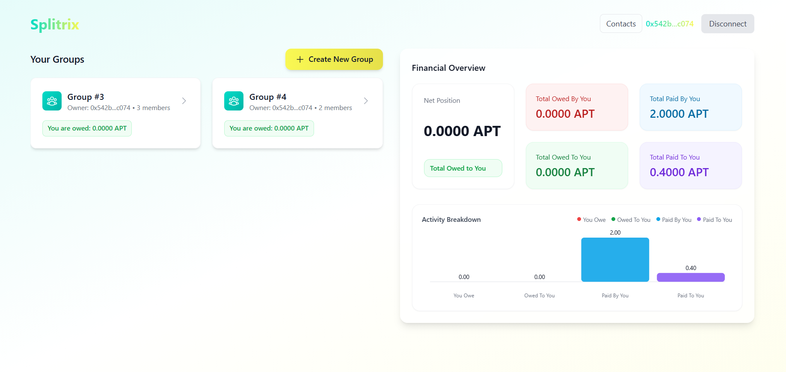
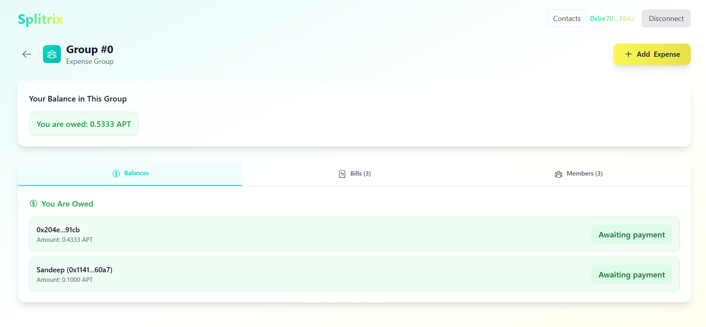
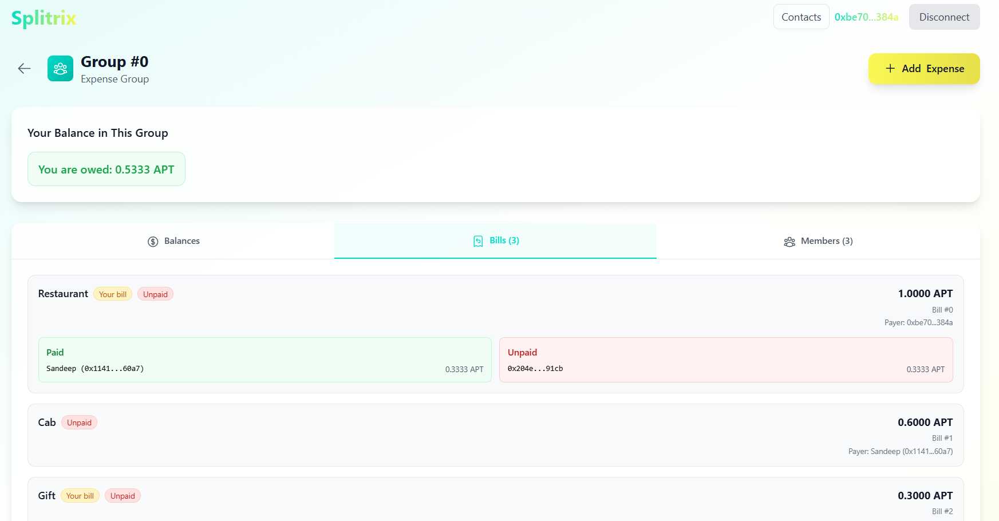
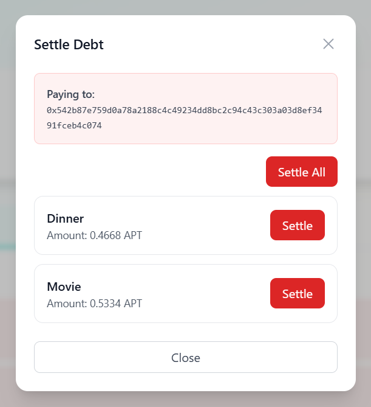
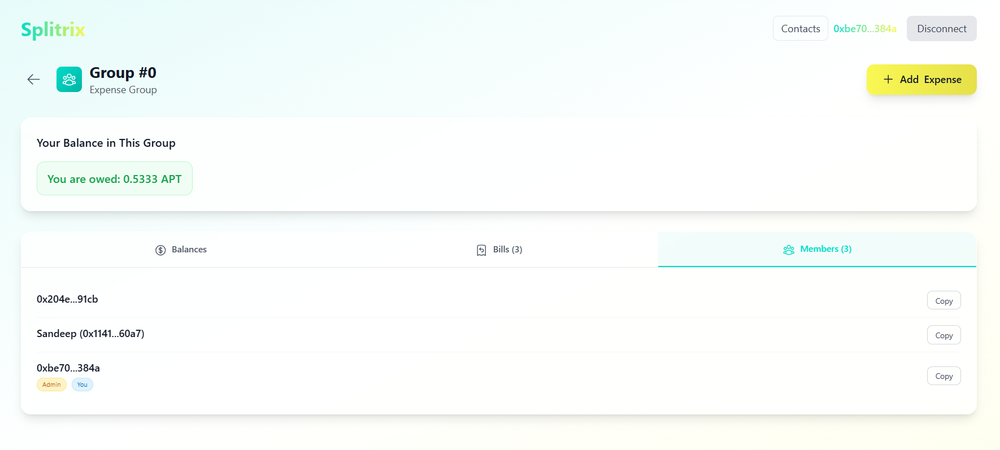
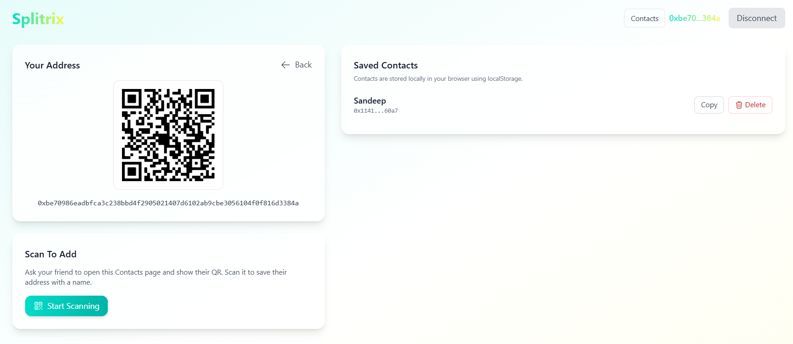

### Splitrix — Decentralized Expense Splitting on Aptos

Splitrix is a Splitwise-like dApp built on the Aptos blockchain. Create groups, add shared expenses, and settle debts using AptosCoin, with a modern React + Vite frontend.

- **Testnet contract address**: `0xf50e2e1a30a1bfc7301cfb163b22c1ae77251ccd1b8e71ec81f08c32406dabfa`

### Screenshots

#### Dashboard - 
Shows all the associated groups and their lifetime statistics



#### Balances - 
Shows the current net balance of the user in the group



#### Add Expense -
Shows the form to add a new expense


#### Bills - 
Shows all the bills in the group



#### Settle Bills -
Settle the bills individually or all at once



#### Members -
Shows all the members in the group



#### Contacts -
Shows all the contacts in the user's address book



### Prerequisites

- **Aptos CLI** (for keys/accounts and network access)
- **Node.js** (v18+ recommended)
- **pnpm** (package manager)

### Environment

Create a `.env` from `.env.sample` and fill the values. Required keys:

```bash
# Network used by SDK and wallet adapter
VITE_APP_NETWORK=testnet

# Publisher account (the address that compiles/publishes the Move package)
VITE_MODULE_PUBLISHER_ACCOUNT_ADDRESS=0x...
VITE_MODULE_PUBLISHER_ACCOUNT_PRIVATE_KEY=0x...

# Deployed module address (auto-written by publish script, or set manually)
VITE_MODULE_ADDRESS=0xf50e2e1a30a1bfc7301cfb163b22c1ae77251ccd1b8e71ec81f08c32406dabfa
```

The Move module name is `splitrix`. Frontend derives fully-qualified function names from `VITE_MODULE_ADDRESS`.

### Install

```bash
pnpm install
```

### Move contract

- **Compile**
```bash
pnpm move:compile
```

- **Publish (deploy)**
```bash
pnpm move:publish
```
This script uses `VITE_APP_NETWORK`, `VITE_MODULE_PUBLISHER_ACCOUNT_ADDRESS`, and `VITE_MODULE_PUBLISHER_ACCOUNT_PRIVATE_KEY`, and writes the resulting object/module address into `VITE_MODULE_ADDRESS` in your `.env`.

### Frontend

- **Run dev server**
```bash
pnpm dev
```

- **Build for production**
```bash
pnpm build
```

### What you can do

- **Create groups** and become the admin/member automatically
- **Add expenses** with flexible splitting:
  - Select exactly which members participate in the bill
  - Choose split mode: percentages or integer shares
  - Percent mode requires an exact total of 100.00% (10,000 basis points); the UI provides an equal-split helper that distributes any remainder (e.g., 33.34/33.33/33.33)
  - Shares mode converts shares to basis points, distributing any remainder to ensure an exact total of 10,000
  - The payer can be included; their share does not create a debt
- **On-chain debt tracking with netting**:
  - Debts are stored per (debtor → creditor → bill_id → amount)
  - Reverse-pair netting is applied when adding expenses (reduces cycles) and bill IDs are tracked FIFO per pair
- **Settle debts** in AptosCoin per bill or all-at-once per creditor:
  - Pay one bill at a time or “Settle All” for a creditor in a single transaction
  - Settlement updates per-bill amounts and maintains FIFO order
- **View activity** across all your groups (bills and member participation)
- **Manage contacts on-chain**:
  - Store `address → name` on-chain, with list and single-name view APIs
  - UI supports QR sharing/scanning and shows your own address as “Me” for clarity

### Tech stack

- Move smart contract (Aptos)
- React + Vite + TypeScript, Tailwind CSS
- `@aptos-labs/ts-sdk`, Aptos Wallet Adapter (Petra)
- TanStack Query for data fetching/caching

### Notes

- Ensure your Aptos CLI and the wallet are on the same network as `VITE_APP_NETWORK`.
- If you already have a deployed contract, set `VITE_MODULE_ADDRESS` directly and skip publish.
- Percent splits must sum to exactly 100.00% before submitting an expense; use “Split equally” to auto-balance.
- When “Settle All” is used for a creditor, all outstanding per-bill entries for that creditor are paid in one transaction.