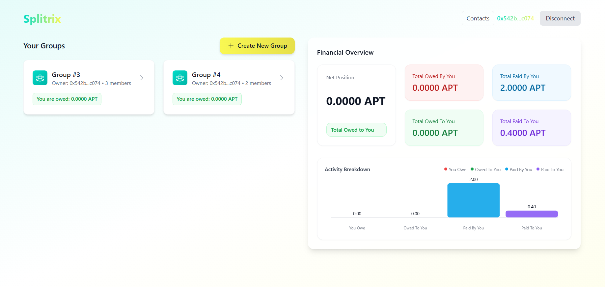
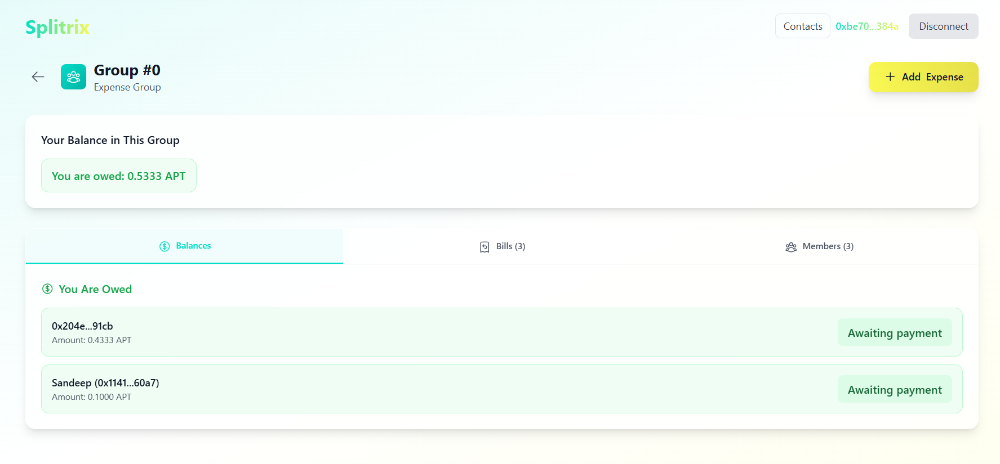
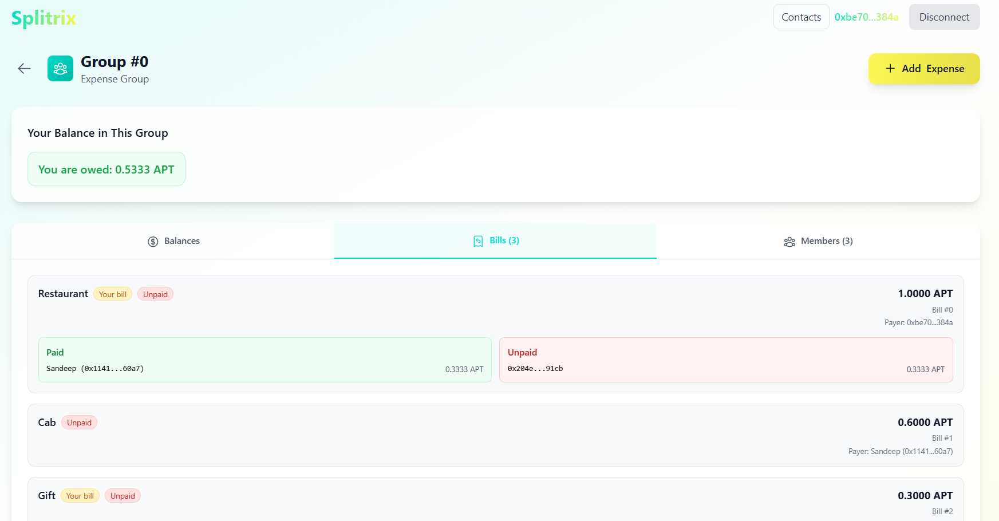
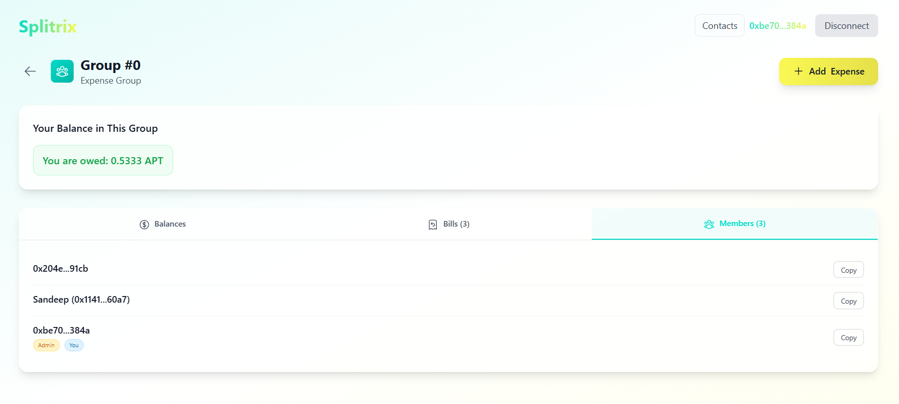
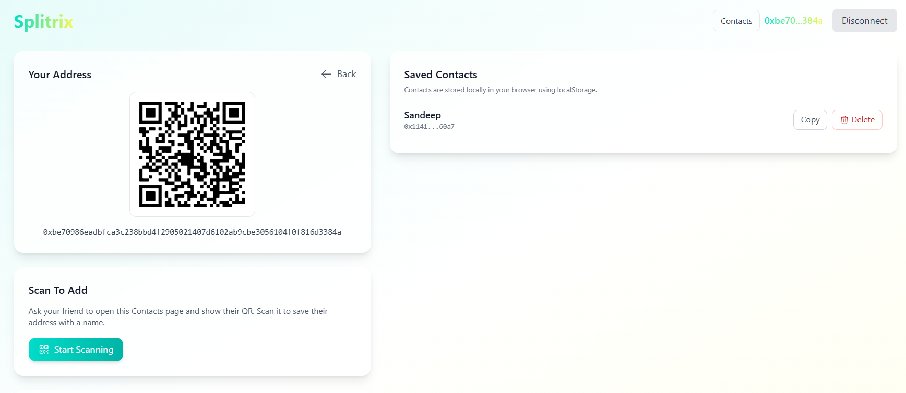

### Splitrix — Decentralized Expense Splitting on Aptos

Splitrix is a Splitwise-like dApp built on the Aptos blockchain. Create groups, add shared expenses, and settle debts using AptosCoin, with a modern React + Vite frontend.

- **Testnet contract address**: `0x61ff281a938e4b1429f1d53382d0e1f619ed3e81f776a49156d1be8e32b141ce`

### Screenshots

#### Dashboard - 
Shows all the associated groups and their lifetime statistics



#### Balances - 
Shows the current net balance of the user in the group



#### Bills - 
Shows all the bills in the group



#### Members -
Shows all the members in the group



#### Contacts -
Shows all the contacts in the user's address book



### Prerequisites

- **Aptos CLI** (for keys/accounts and network access)
- **Node.js** (v18+ recommended)
- **pnpm** (package manager)

### Environment

Create a `.env` from `.env.sample` and fill the values. Required keys:

```bash
# Network used by SDK and wallet adapter
VITE_APP_NETWORK=testnet

# Publisher account (the address that compiles/publishes the Move package)
VITE_MODULE_PUBLISHER_ACCOUNT_ADDRESS=0x...
VITE_MODULE_PUBLISHER_ACCOUNT_PRIVATE_KEY=0x...

# Deployed module address (auto-written by publish script, or set manually)
VITE_MODULE_ADDRESS=0x61ff281a938e4b1429f1d53382d0e1f619ed3e81f776a49156d1be8e32b141ce
```

The Move module name is `splitrix`. Frontend derives fully-qualified function names from `VITE_MODULE_ADDRESS`.

### Install

```bash
pnpm install
```

### Move contract

- **Compile**
```bash
pnpm move:compile
```

- **Publish (deploy)**
```bash
pnpm move:publish
```
This script uses `VITE_APP_NETWORK`, `VITE_MODULE_PUBLISHER_ACCOUNT_ADDRESS`, and `VITE_MODULE_PUBLISHER_ACCOUNT_PRIVATE_KEY`, and writes the resulting object/module address into `VITE_MODULE_ADDRESS` in your `.env`.

### Frontend

- **Run dev server**
```bash
pnpm dev
```

- **Build for production**
```bash
pnpm build
```

### What you can do

- **Create groups** and become the admin/member automatically
- **Add expenses** split equally among members (bill tracking per member)
- **Settle debts** in AptosCoin; per-bill FIFO breakdown and aggregates are maintained on-chain
- **View balances and activity** across all your groups
- **Manage contacts** (QR code share/scan, local storage)

### Tech stack

- Move smart contract (Aptos)
- React + Vite + TypeScript, Tailwind CSS
- `@aptos-labs/ts-sdk`, Aptos Wallet Adapter (Petra)
- TanStack Query for data fetching/caching

### Notes

- Ensure your Aptos CLI and the wallet are on the same network as `VITE_APP_NETWORK`.
- If you already have a deployed contract, set `VITE_MODULE_ADDRESS` directly and skip publish.


